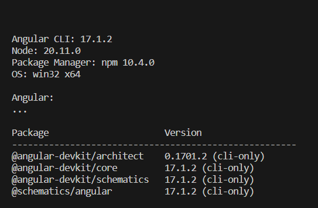
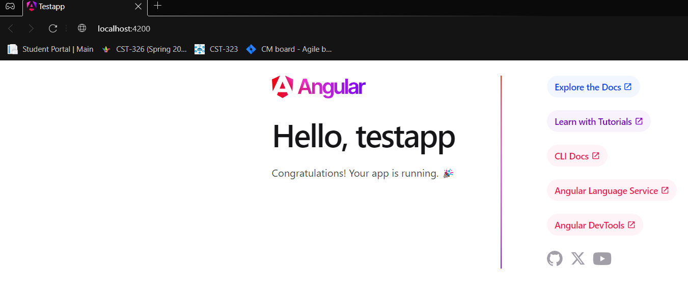
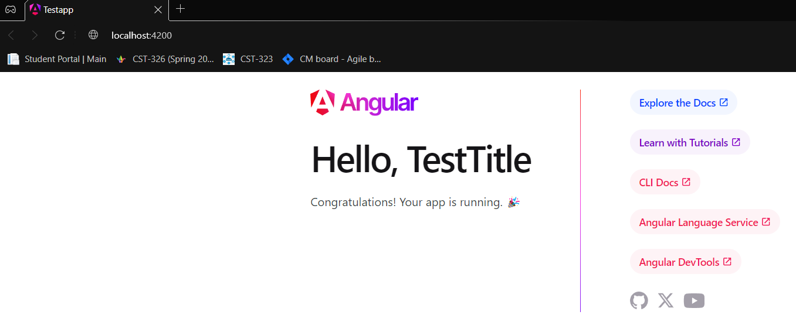
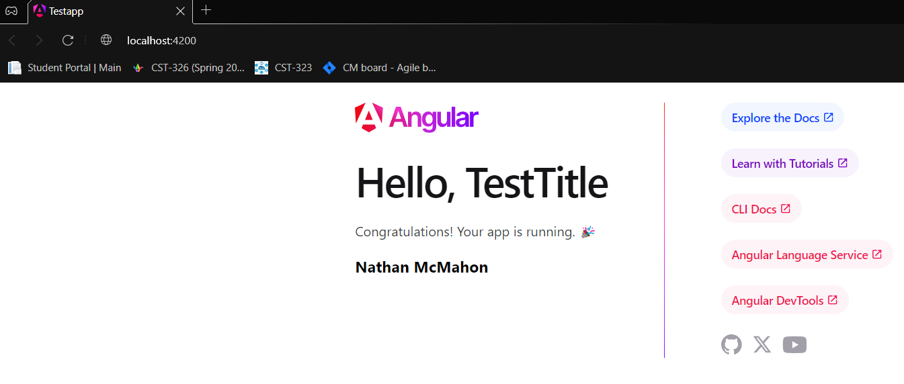

# CST391

## Activity 1
- This is my activity 1
- CST-391
     - JavaScript Web Application Development
     - Angular Tools & First App
     - Nathan McMahon

### ScreenShots
Angular Version

Test app first screenshot

Test app with new title

Test app with message

## Research Questions
a. **Folders:**

- node_modules:
    - Purpose: This folder contains all the external libraries and dependencies that your Angular project needs. When you install packages using npm (Node Package Manager), they are stored in this directory.

- src:

    - Purpose: This is the source code directory where you write and organize your Angular application code. It contains subdirectories for different parts of your application.

- src/app:

    - Purpose: This directory is the main location for your application's components, services, modules, and other Angular-related files. Components and services created here contribute to the structure and functionality of your application.

- src/assets:

    - Purpose: This folder is used to store static assets such as images, stylesheets, fonts, etc. These assets can be referenced and used within your application.

- src/environments:

    - Purpose: This folder holds environment-specific configuration files. Typically, you have environment.ts for development and environment.prod.ts for production. These files can contain settings like API endpoints or other configuration variables that may differ between development and production environments.

**Files:**
- angular.json:

    - Purpose: This file is the configuration file for Angular CLI. It defines various settings and options for your Angular project, such as build configurations, asset paths, and other build-related settings. It also manages the configuration of your project's build process.

- package.json:

    - Purpose: This file is used to manage the dependencies and scripts for your project. It contains information about the project, its dependencies, and scripts for tasks like building, testing, and running the application. The npm install command reads this file to install the necessary packages listed as dependencies.

- tsconfig.json:

    - Purpose: TypeScript configuration file that specifies how the TypeScript compiler should compile your TypeScript code. It includes settings like target ECMAScript version, module resolution, and other compiler options. This file ensures that your TypeScript code is transpiled into JavaScript according to your project requirements.

b. 
- main.ts:

    - Overview: This is the entry point of the Angular application. It initializes the Angular platform and bootstraps the root module of the application.
    - Purpose: It imports necessary modules and kicks off the application by calling platformBrowserDynamic().bootstrapModule(AppModule), where AppModule is the root module of the application.
    
- app.component.css:

    - Overview: This file contains the styles (CSS) specific to the Angular component defined in app.component.ts.
    - Purpose: It encapsulates the component-specific styles, helping to keep the styles modular and scoped to the component, following the principles of component-based architecture.

- app.component.html:

    - Overview: This file contains the HTML template for the Angular component defined in app.component.ts.
    - Purpose: It defines the structure of the component, specifying how the component should render in the browser. The HTML template may include Angular directives and bindings to dynamically display data and interact with the component's logic.

- app.component.ts:

    - Overview: This TypeScript file defines the Angular component, including its logic, properties, methods, and lifecycle hooks.
    - Purpose: It encapsulates the behavior of the component. It may interact with services, manage data, handle user interactions, and define the component's lifecycle events. The component class is typically associated with an HTML template and CSS styles.

- app.module.ts:

    - Overview: This file defines the root module of the Angular application.
    - Purpose: It imports and declares the components, services, and other modules used in the application. The @NgModule decorator in this file provides metadata for Angular to understand how to compile and run the application. It is crucial for organizing and configuring the various parts of the application.