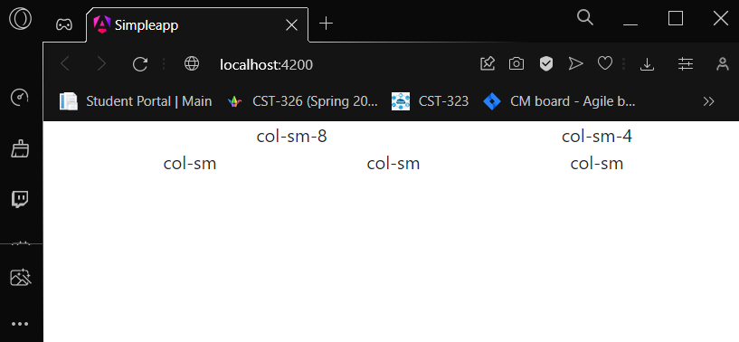
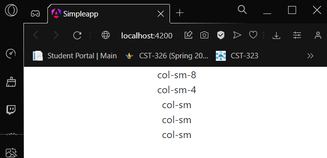
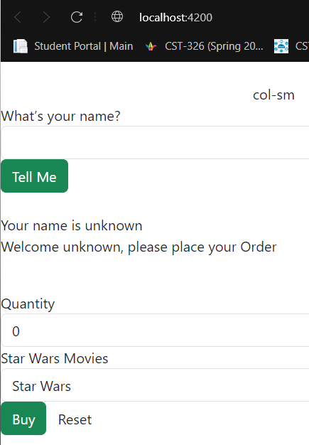
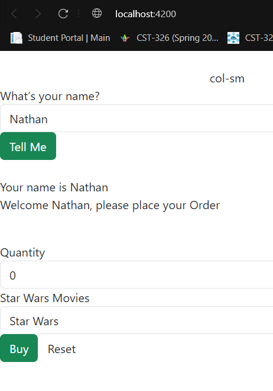

# CST391

## Activity 3
- This is my activity 3
- CST-391
     - JavaScript Web Application Development
     - Angular Music App Fixed Data
     - Nathan McMahon

## Part 1
### ScreenShots
Bigger Screen

Smaller Screen

Before Name

After Name

### Research Questions

1. The `@Input` decorator in Angular is utilized to define data-bound input properties within a component. By using this decorator, a child component can receive data from its parent component, enabling a dynamic exchange of information. In the `info.component.ts` file, the `@Input` decorator is applied to the `infoData` property, designating it as a property that can accept input. When incorporating the `InfoComponent` in a parent component's template, data is bound to it using square brackets, allowing for the transmission of information from the parent to the child component.

2. The `[value]` syntax in Angular's template syntax is used for property binding. When applied to an element or directive attribute, it allows the dynamic assignment of a property's value based on a corresponding property in the component class. In the context of `info.component.html`, assuming a property named `value` is declared in the `InfoComponent` class, `[value]` would be employed to bind the value of the property dynamically. For instance, if used in an input element, it might look like `<input [value]="someValue">`, where `someValue` is a property in the `InfoComponent` class. This approach enables the synchronization of the template and component data, ensuring a responsive and data-driven user interface.
3. `[(ngModel)]` is a two-way data binding syntax in Angular used primarily with form controls. It combines property binding (`[()]`) and event binding `()` to establish a bidirectional connection between the view (template) and the component class. In the context of `info.component.html`, if applied to an input element like `<input [(ngModel)]="infoData">`, it implies that changes to the input field will update the `infoData` property in the component class, and vice versa. The `ngModel` directive requires importing the `FormsModule` in the corresponding module to enable its usage. This two-way binding simplifies the synchronization of user input and component data, enhancing the interactive nature of the application's forms.

## Part 2
