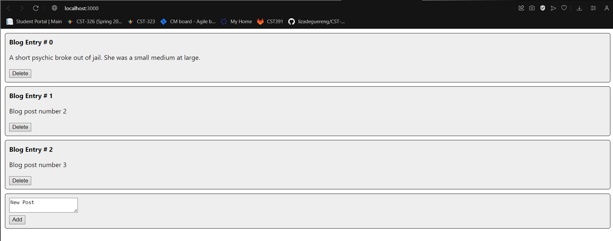
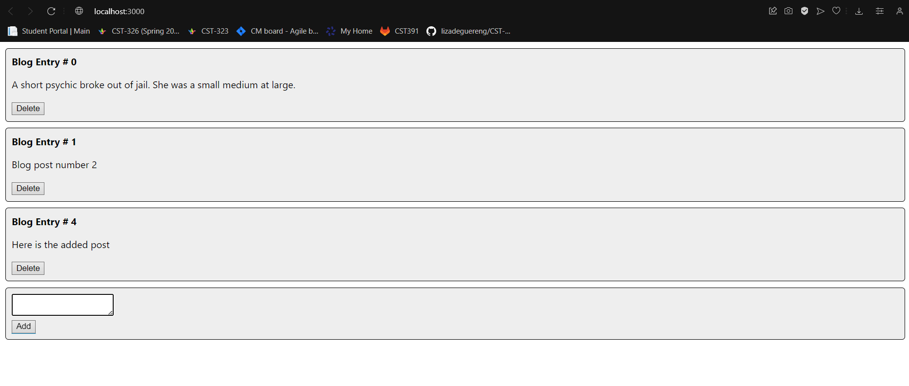
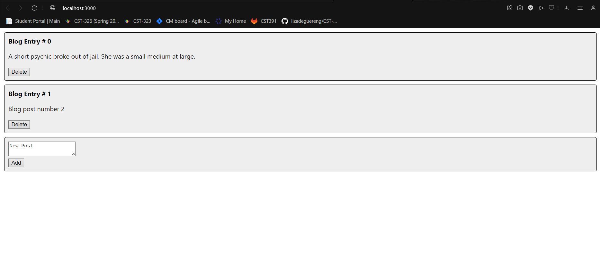

# CST391

## Activity 7
- This is my activity 7
- CST-391
     - JavaScript Web Application Development
     - Angular Music App Fixed Data
     - Nathan McMahon

## Mini App
### ScreenShots
Home Page

Add button

Delete Button

The new features that were added in this activity are the add and delete buttons that allow a user to add and delete from the list of items that are shown on the app.