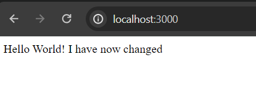

# CST391

## Activity 0

- This is my activity 0 
- CST-391
     - JavaScript Web Application Development
     - Milestone Proposal
     - Nathan McMahon

- This is my helloex screenshot

bobby cv644:30 PM
git clone - copies from the repository to the local workspace
bobby cv644:33 PM
https://gitlab.com/bobby.estey/gcuStudent/-/blob/main/CST391/docs/topic01/activity0.md?ref_type=heads
bobby cv644:44 PM
git status - gives status between repository and local workspace
bobby cv644:46 PM
.gitignore
**/bin/
**/node_modules/
**/recordings/
bobby cv644:48 PM
git add .
bobby cv644:50 PM
git command -m "message"
git commit -m "message"
bobby cv644:52 PM
git push
pushes up to the repository