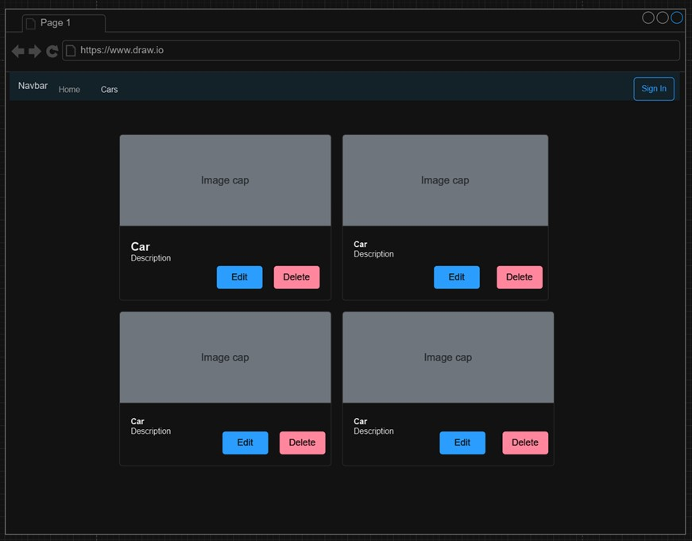

# Instructor Feedback
"Nathan, thank you for meeting all requirements on this assignment and using Markdown as your documentation resource.
Nathan, as you continue to use Markdown your pages will start incorporating other new features that will stand out.  GREAT JOB, Bobby"

## How I addressed the feedback
I read the feedback and was happy with my work :)

# Milestone 2
- CST-391
- Milestone Project Proposal
- Nathan McMahon

I will be creating a website to list cars. The site will allow an admin-user to view a home page, and navigate from Home to a Car Product page. From the Product page, the admin will be able to create, delete, and edit the cars. 

## User Story
1. **Support Product in MySQL Database**
 - As a system user, I want the system to support a product, which is any object represented as a class with multiple properties. The product should include properties with at least three different data types in the MySQL database.
 2. **Implement CRUD Operations**
 - As a user of the web application, I want the ability to perform CRUD operations (Create, Read, Update, Delete) on a "product." This includes listing existing products, creating new products, viewing details of a product, updating product information, and deleting a product.
 3. **Design and Develop Back-end Services**
 - As a developer, I want to design and develop back-end services using Express and NodeJS. These services will be used by two front-end web applications. The implementation of the REST API should act as a facade over any business logic required to process back-end data and interact with the MySQL relational database.
 4. **Create Angular Web Application**
 - As a developer, I want to design and develop a front-end web application using the Angular JavaScript Framework. The web application should be integrated with the REST APIs developed using Express.
 5. **Create React Web Application**
 - As a developer, I want to redeploy the front-end web application using the React JavaScript Framework. This aims to provide flexibility and options for users who prefer using the React framework.
 6. **Document Technical Decisions and Designs**
 - As a team member, I want to document all technical decisions and designs in a design report. This report will capture appropriate UML diagrams, ER diagrams, UI designs, and other technical artifacts necessary to support the design of the end-to-end solution and application.

 ### Er Diagram
 
 ### UI Sitemap
 
 ### Wireframes
 HomePage
 
 ProductPage
 

 ### UML Classes
 

 #### Unknowns and Risks
 The unknowns and risks are that I have never done this type of application in javascript, only java and c#. I am not sure how the technicalities will change using a different language.

 ## Rest API
 My rest api is gonna be a simple product API that uses

 - GET
 - POST
 - PUT
 - DELETE